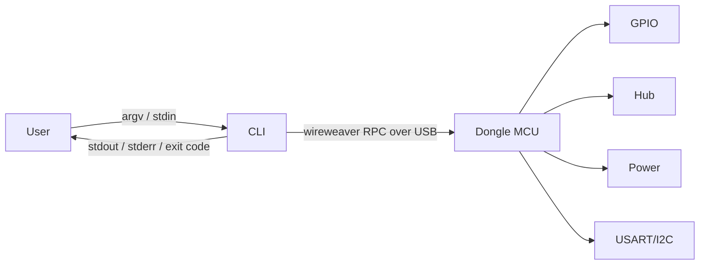

# CLI Design

This document describes the design of the **Donguru command-line interface**:
its goals, its command surface, how it is configured, and how it composes with
other Unix tools. A companion page covers the
[implementation details](implementation.md) (crate selection, module layout,
testing, packaging).

!!! info "Status"

    This is a **design document**. It captures intent and decisions. Where a
    detail is still open it is marked with a *TBD* note so it can be resolved
    during implementation.

## Goals

The CLI is the primary way a user interacts with a [Donguru](../../index.md)
dongle from a host computer. It must be:

- **Unix-native** — line-oriented, pipeable, and scriptable. It reads from
  arguments/stdin and writes results to stdout, diagnostics to stderr, and
  signals outcome through exit codes.
- **Easy to type and memorable** — short, consistent verbs. A short binary
  alias. Sensible defaults so the common case needs few flags.
- **Layered and predictable configuration** — defaults, config files, then
  environment, then command-line flags, each overriding the previous.
- **Cross-platform** — Linux is the priority target, followed by macOS, then
  Windows. Nothing in the design should hard-code Linux-only assumptions.
- **Extensible** — third parties can add subcommands without modifying the
  core, using a Git/Cargo-style discovery mechanism.

## Non-goals

- The CLI is **not** a daemon or a long-running service. Each invocation does
  one job and exits. (A `watch`/`monitor` mode may stream until interrupted,
  but it is still a single foreground process.)
- The CLI is **not** a GUI and makes no assumptions about a terminal being
  interactive. All behaviour must degrade cleanly when stdout is a pipe.

## What the CLI controls

The Donguru dongle exposes several subsystems. The CLI groups its commands to
match them:

| Subsystem   | Responsibility                                              |
| ----------- | ----------------------------------------------------------- |
| Firmware    | Report firmware version and update the dongle firmware.     |
| GPIO        | Read and drive general-purpose I/O pins.                    |
| USB Hub     | Enable/disable and inspect downstream USB ports.            |
| Power       | Control the power switch and read the power meter (V/I).    |
| Bus bridge  | USART / I2C access for prototyping and debugging.           |
| Device      | Enumerate and select dongles, report identity and status.   |

## Transport model

The host talks to the dongle over a **control channel exposed by the dongle's
MCU**. The channel is carried over USB, and the wire protocol is
[**WireWeaver**](https://github.com/vhrdtech/wire_weaver). The CLI treats this
as a typed request/response transport: each subcommand maps to one or more RPC
calls.



Design Notes:

- The transport layer should be **abstracted behind a trait** so the RPC surface can
  be exercised in tests with a mock, and so an alternative transport (e.g. a
  raw serial fallback) can be added later without touching command code.
- Firmware update is exposed through the same front end even though its
  underlying mechanism (bootloader/DFU flow) is *TBD*. The user-facing command
  is stable regardless of how flashing is implemented.

## Many small tools behind a single front end

Like `git`, Donguru presents a **single, user-facing front end** while the
project itself is assembled from many small, targeted tools (binaries, scripts,
…) such as `donguru-gpio`, `donguru-update`, and so on.

The front-end binary that assembles the full subcommand tree is named
**`donguru`**, with a short alias **`dg`**. It is the single point of contact
for a regular user. Rationale:

- **One thing to install, discover (`donguru help`), and version.**
- **Shared behaviour lives in one place.** Configuration, device selection, and
  output formatting are implemented once in the front end instead of being
  duplicated in every tool.
- **A subcommand tree is familiar.** Tools like `git`, `cargo`, `docker`, and
  `ip` follow the same pattern, and it is easy to explore via `--help` at every
  level.

This approach keeps the *benefits* of separate, independently developed tools
while giving the user a single entry point. Because configuration loading and
layering is itself exposed as a command (see [Configuration](#configuration)),
both built-in commands and later-added **plugin** commands can reuse the same
mechanism.

### Naming

- **Canonical binary:** `donguru`.
- **Short alias:** `dg` (installed alongside, the same executable under two
  names).
- **Subcommands** are short, lowercase verbs and nouns. Prefer `noun verb`
  grouping where a subsystem has several actions (e.g. `gpio read`,
  `power on`), and a bare verb where there is only one obvious action.
- **Third-party extensions** are encouraged to add a two-letter namespace after
  the `donguru-` prefix to avoid future collisions with built-ins that do not
  exist yet — e.g. `donguru-vh-scan` is invoked as `donguru vh-scan`.

## Command tree

The following is the intended top-level surface. Names are chosen to be short
and memorable, every node supports `--help`.

```text
donguru
├── device            # enumerate and inspect dongles
│   ├── list          # (alias: ls) list connected dongles
│   ├── info          # identity, serial, firmware version
│   └── select        # persist a default device for this project
├── gpio
│   ├── read <pin>    # read one or more pins
│   ├── write <pin> <level>
│   ├── mode <pin> <in|out|...>
│   └── watch <pin>   # stream level changes until interrupted
├── usb               # downstream hub ports
│   ├── list          # port map and status
│   ├── on <port>     # enable a downstream port
│   └── off <port>    # disable a downstream port
├── power
│   ├── on|off        # power switch to downstream devices
│   ├── status        # switch state
│   ├── meter         # instantaneous voltage/current
│   └── watch         # stream meter readings until interrupted
├── i2c
│   ├── scan          # probe the bus for devices
│   ├── read <addr> <reg> [len]
│   └── write <addr> <reg> <bytes...>
├── uart              # USART bridge
│   └── ...           # TBD: open/attach a serial bridge
├── fw                # firmware
│   ├── version       # report running firmware version
│   └── update <image>  # update the dongle firmware
├── completions <shell>  # generate shell completions
├── config            # generate a default config, and inspect/evaluate the effective one
└── help
```

## Global flags

These flags are accepted at every level of the tree and apply to all
subcommands. They are collected here so the individual command sections can stay
focused on their own arguments.

| Flag                    | Purpose                                                        |
| ----------------------- | -------------------------------------------------------------- |
| `-d, --device <sel>`    | Select the target dongle (see [Device selection](#device-selection)). |
| `-f, --format <fmt>`    | Output format: `text` (default), `json`, or `jsonl`.           |
| `--color <when>`        | Colour output: `auto` (default), `always`, or `never`.         |
| `-v, --verbose`         | Increase diagnostic detail on stderr (repeatable, e.g. `-vv`). |
| `-q, --quiet`           | Suppress non-essential stderr output.                          |
| `-h, --help`            | Show help for the current command.                             |
| `-V, --version`         | Print the `donguru` version and exit.                          |

## Unix-philosophy

The CLI is built to be a good citizen in pipelines.

- **stdout is data, stderr is diagnostics.** Only requested results go to
  stdout. Progress, warnings, and errors go to stderr, so `donguru … | jq`
  never sees log noise.
- **Exit codes are meaningful.** `0` success; non-zero on failure with distinct
  codes for categories (usage error, no device, transport error, device error,
  timeout). These are documented in [implementation](implementation.md).
- **Output formats are selectable.** A global `--format`/`-f` flag chooses the
  representation:
    - `text` (default) — human-readable, aligned, possibly colourised when
      stdout is a TTY.
    - `json` — one JSON value, for machine consumption.
    - `jsonl` — newline-delimited JSON for streaming commands (`watch`).
- **No colour / no interactivity when piped.** Colour and progress spinners are
  auto-disabled when stdout is not a TTY, and can be forced with
  `--color=always|never`. Honour `NO_COLOR`.
- **Read from stdin where it composes.** Byte payloads (e.g. `i2c write`,
  `fw update -`) may be read from stdin so data can be piped in.
- **Quiet and verbose knobs.** `-q/--quiet` suppresses non-essential stderr;
  `-v/--verbose` (repeatable) increases diagnostic detail.

Example pipelines:

```bash
# Machine-readable power reading fed to jq
dg power meter -f json | jq .current_ma

# Stream GPIO changes into a log
dg gpio watch 3 -f jsonl >> gpio.log
```

## Configuration

Configuration is **layered**. Later layers override earlier ones on a per-key
basis: a lower-priority layer still provides any keys that a higher-priority
layer omits.

!!! note "Ideal three-state merge"

    Where the libraries make it practical, a richer merge that distinguishes
    three states per key — **None**, **Default**, and **Some(value)** — would be
    preferable. The rules would be:

    - A previous layer's **None** or **Default** can always be overwritten by
      the next layer.
    - If the current layer explicitly sets **None**, a **Default** or
      **Some(value)** from a previous layer takes precedence.
    - An explicit **Some(value)** in a higher layer always wins.

    Whether this is worth the added complexity depends on library support and
    is left open for implementation.

| Priority       | Layer                 | Source                                     |
| -------------- | --------------------- | ------------------------------------------ |
| 0 (lowest)     | Built-in defaults     | Compiled-in fallback values.               |
| 1              | Config file: global   | System-wide (e.g. `/etc/donguru/config.toml`). |
| 2              | Config file: user     | Per-user (e.g. `~/.config/donguru/config.toml`). |
| 3              | Config file: project  | `donguru.toml`/`.donguru.toml` found by walking up from the CWD. |
| 4              | Environment variables | `DONGURU_`-prefixed variables.             |
| 5 (highest)    | Command-line flags    | Explicit flags.                            |

Higher priority numbers override lower ones on a per-key basis.

- **Config files** use a documented format (TOML) and are searched in three
  scopes, merged in order:
    - **global** — system-wide (e.g. `/etc/donguru/config.toml`).
    - **user** — per-user, via the platform config dir
      (e.g. `~/.config/donguru/config.toml`).
    - **project** — a `donguru.toml` (or `.donguru.toml`) discovered by walking
      up from the current directory, so a repository can pin settings such as a
      default device.
- **Environment variables** use a `DONGURU_` prefix and mirror the key path
  (e.g. `DONGURU_DEVICE`, `DONGURU_OUTPUT`).
- **Command-line flags** always win.

Typical configurable keys: default device selector, default output format,
default timeouts, log verbosity. The exact schema and precedence mechanics are
specified in [implementation](implementation.md).

## Device selection

With multiple dongles connected, a single device is chosen by, in order:

1. `--device/-d <selector>` flag,
2. `DONGURU_DEVICE` environment variable,
3. a `device` key from the config layers (e.g. a project pin),
4. auto-selection when exactly one dongle is present.

A *selector* may be a serial number, an index, or a USB path. If none of the
above resolves to exactly one device, the CLI errors and asks the user to
disambiguate (and `device list` shows the choices).

## Extensibility

The core is extended with a **Git/Cargo-style external subcommand** mechanism.
When `donguru foo` is run and `foo` is not a built-in subcommand, the CLI
searches `PATH` for an executable named `donguru-foo` and executes it,
forwarding the remaining arguments and the resolved context (selected device,
output format) via environment variables (e.g. `DONGURU_DEVICE`,
`DONGURU_OUTPUT`).

- Plugins are ordinary executables in any language.
- `donguru help` lists discovered plugins alongside built-ins.
- Naming convention: `donguru-<name>` → `donguru <name>` (mirrors
  `git-<x>`/`cargo-<x>`).

This preserves the single-front-end user experience while letting features be
developed, shipped, and versioned independently.

## Open questions

- **WireWeaver surface** — the exact RPC schema and how firmware update is
  carried over it (*TBD*, tracked with firmware work).
- **Windows specifics** — driver/enumeration differences for USB access on
  Windows (lowest priority target).
