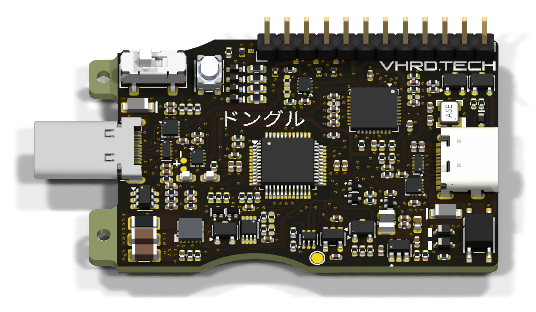

# Donguru — ドングル { style="text-align:center" }

A USB-Type-C dongle with a **USB Hub**, **USART / I2C / GPIO / ADC**, a
**power switch** and a **power meter**
{ style="text-align:center" }

{ width="420" style="display:block;margin:0 auto" }

Plus a fast, scriptable command-line interface to drive it all.
{ style="text-align:center" }

[Get started](user/quickstart.md){ .md-button .md-button--primary }
[Explore the CLI](user/usage.md){ .md-button }

---

## What it does

-   :material-usb: __USB Hub__

    ---

    Control downstream USB port(s) power, data lines, CC
    lines etc.

-   :material-connection: __USART / I2C / GPIO / ADC__

    ---

    General-purpose interfaces for prototyping, bring-up, debugging and testing.

-   :material-power-plug: __Power switch__

    ---

    Enable or disable power to downstream devices on demand.

-   :material-gauge: __Power meter__

    ---

    Monitor voltage and current draw in real time.

## Take the tour

-   :lucide-book-open-check: __Documentation__

    ---

    Quickstart and everyday usage of the `donguru` (`dg`) CLI from an end-user
    point of view.

    [:octicons-arrow-right-24: Start here](user/quickstart.md)

-   :lucide-wrench: __Development__

    ---

    Set up your environment and build everything yourself.

    [:octicons-arrow-right-24: Start building](development/index.md)

-   :lucide-terminal: __CLI__

    ---

    Understand the `donguru` (`dg`) command-line interface: design, command tree and
    it's unixi archtitecture.

    [:octicons-arrow-right-24: Read the design](design/cli/index.md)

-   :lucide-drafting-compass: __Design__

    ---

    Design documents, the library evaluations etc. to understand our decisions and desings.

    [:octicons-arrow-right-24: Browse designs](design/index.md)

-   :lucide-info: __About__

    ---

    What Donguru is, its feature set, and where to go next.

    [:octicons-arrow-right-24: Learn more](about/index.md)

